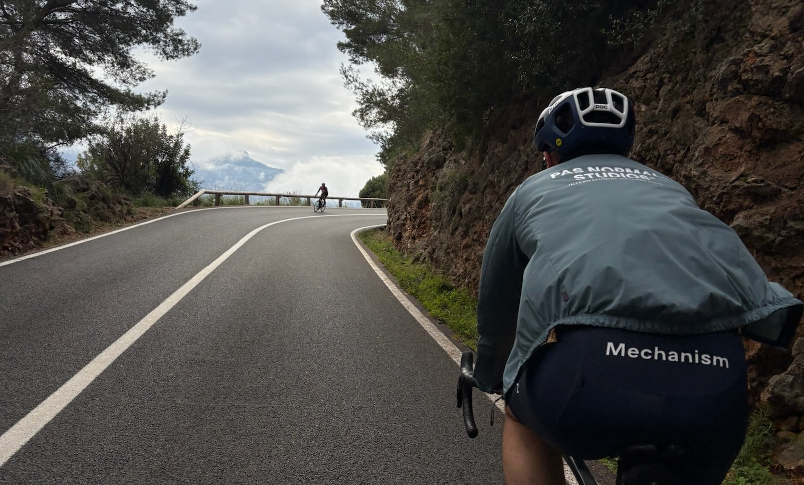

+++
date = '2025-05-27T18:16:50+02:00'
draft = false
title = 'Who I am?'
+++

My name is Guillaume, I guess you could describe me as an introspective adventurer - someone who loves pushing both his body and mind. As a passionate endurance athlete, I find joy and meaning in cycling, running, and the daily pursuit of becoming a bit better than I was yesterday.

I’m also deeply curious about how the world works. I find myself drawn to philosophy, economics, and the big questions around free will, consciousness, and human behavior. I enjoy challenging ideas and exploring different perspectives - not just to understand, but to grow.

Professionally, I work in business intelligence, supporting and leading teams, always looking for ways to improve systems and empower others. Personally, I value presence—quiet moments with loved ones, meaningful conversations, and a good laugh (which people say is pretty distinctive).

I live mostly in the present, but trying to think a few steps ahead - whether it’s learning new things, refining my training, or designing a more intentional life. I guess you could say I like moving forward - just maybe a little slower, and with purpose.

