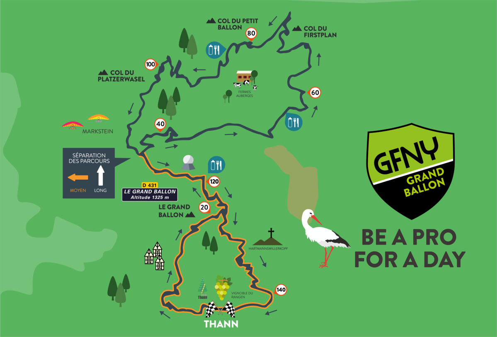
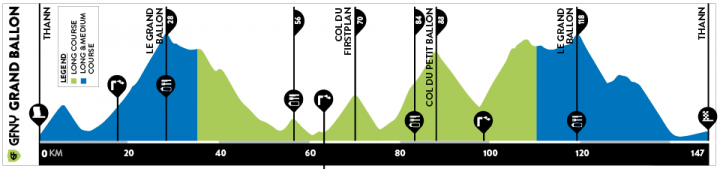
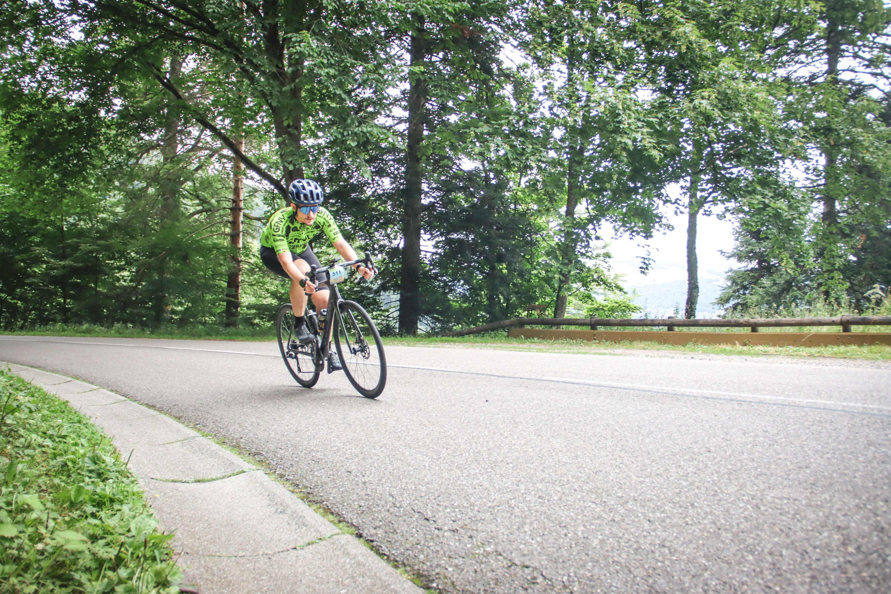
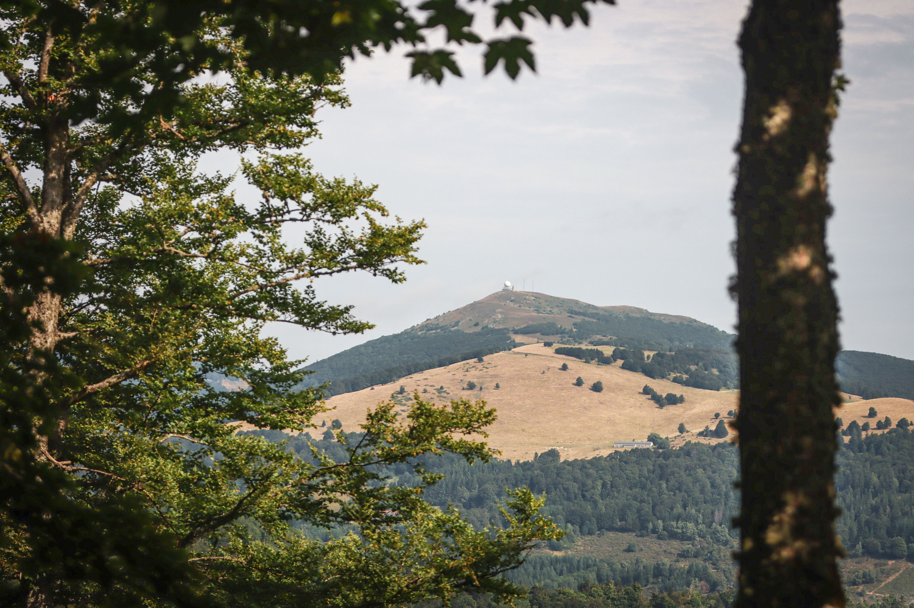
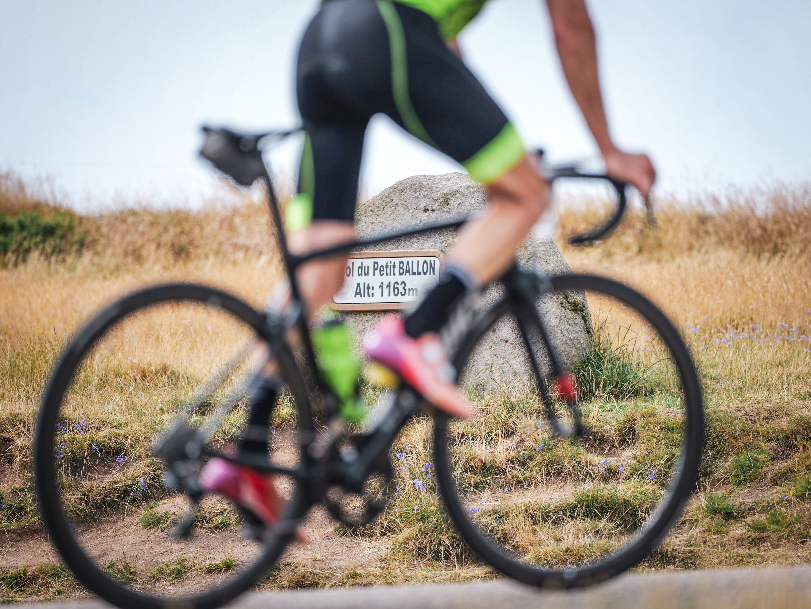
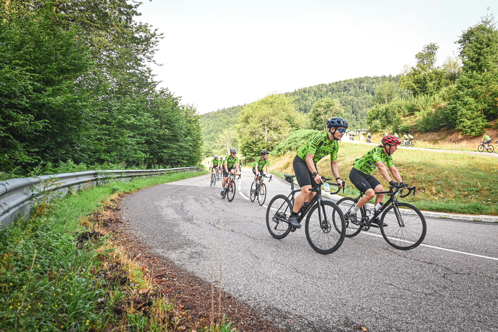
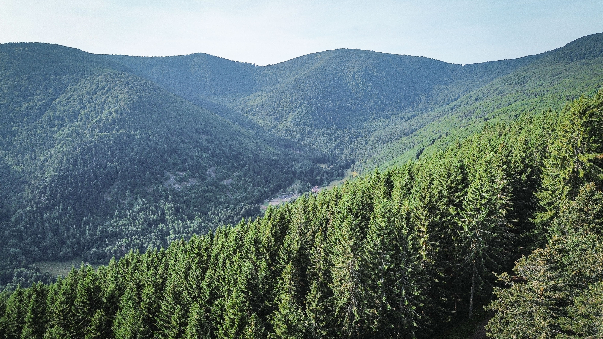

+++
date = '2025-07-20'
draft = false
title = 'My First Real Bike Race – GFNY Grand Ballon 2025'
description = "My experience racing the GFNY Grand Ballon 2025, my very first bike race. From the excitement of the start line to battling steep climbs and unexpected cramps."
keywords = ["GFNY Grand Ballon 2025", "GFNY race recap", "first bike race experience", "beginner cycling race", "GFNY France 2025", "Grand Ballon d’Alsace climb", "Petit Ballon cycling", "tips for first bike race", "cycling race fuel mistakes", "road cycling in Alsace", "sportive race tips", "beginner road cyclist story", "bike race cramps", "GFNY race tips", "Grand Ballon race review"]
+++

Today was a great milestone: I raced my first official bike race the [GFNY Grand Ballon](https://grandballon.gfny.com/?lang=en)!

I’ve done several running events, including three marathons, and multiple triathlons such as the Luxembourg Ironman 70.3. But until now, I had never taken part in a pure cycling race. I had always pushed the idea back, partly out of fear: fear of the mass start, fear of high-speed descents surrounded by other riders, and probably, fear of confronting my real limits as a cyclist.

Most of my cycling until now has been comfortable. Not easy, because I have done several challenging 300+ km rides such as the lap of Mallorca or the Tour of Luxembourg, but it was always in relaxed environment with my friends, stopping when we felt like it. Those rides have always been about endurance, not intensity. Racing on steep climbs, my weakest terrain, felt intimidating.

## The Race Day

The race started at 7:45 AM, so we had to be at the starting point between 7:00 and 7:30. That meant waking up at 5:00 AM for a solid breakfast, coffee, and praying for a good poop (which, sadly, did not happen for me… Mistake #1).

The course began with a 250-meter elevation gain through the forest, a good way to spread out the peloton after the mass start. I tried to stay on Antoine’s wheel, but after 20 minutes at ~300 watts and a heart rate of 160–165 bpm (mistake #2), I realized I was going above my sustainable effort and decided to let him go. I settled into my own rhythm.

To my relief, the mass start was far less chaotic than I feared. I didn’t feel in danger, and the energy of the race was actually thrilling.

## The Grand Ballon

After the first climb and a fast descent back to Thann, where riders passed me from both sides at lightning speed, we reached the most iconic climb of the day: the **Grand Ballon d’Alsace**. Around 1,000 meters of elevation at a steady 6%. I paced myself carefully, following my Garmin Power Guide, and reached the top after about an hour.

There was a food station at the summit, which I skipped thinking that I had enough water and would gain more time by pushing to the next feed station (mistake #3).

## The Petit Ballon and Beyond

From there, the day became a blur of fast descents and rolling climbs until I reached the dreaded **Petit Ballon**. It’s “petit” only in name: around 750 meters of climbing, with punishingly irregular gradients and multiple steep sections above 10%. My legs started to feel very heavy and I was struggling to follow my planned power.

A small relief came from the local residents spraying us with water hoses: an absolute lifesaver in the heat! Although… it also mixed with sweat, gels, and dirt on my sunglasses, blinding me for the next descent.

Directly after that descent came the last real climb of the day, a challenging (but lesser-known) climb of around 660 meters. I was happy it was the final real ascent of the day, until the cramps started. I had to stop twice to stretch, and I couldn’t push hard on the flatter sections which are usually my strong suit!

## Final Push

At the last aid station on the Grand Ballon, I downed some isotonic drinks and even ate salt packets, desperate times! That helped reduce the cramps, and I managed to push through the final 20 km: 15 km of descent and 5 km of flat(ish) road back to Thann.

I crossed the finish line after 6 hours and 30 minutes, exhausted, proud, and humbled. Antoine and Steven finished 15 and 30 minutes ahead of me, and while I wish I could’ve competed with them more closely, I am happy I gave my best effort!

## Reflections

This race taught me more than I expected, not just about endurance, but about strategy, fueling, and preparation. I made a few key mistakes along the way, and I’m glad I did, because I won’t repeat them next time. Here are the biggest lessons I’m taking with me:

### 1. Pace yourself at the start.
At the beginning of a race, especially a mass start, it’s easy to get swept up in the adrenaline. You feel fresh, strong, and excited. But going too hard in the early climbs can burn matches you’ll need later. Trust your pacing plan and ride your own race. You’ll thank yourself on the final climb.

### 2.	Don’t underestimate hydration and fueling, especially on a hot day.
I made the rookie mistake of skipping the first feed station to save a few minutes. That choice came back to haunt me in the form of cramps and fatigue during the last climbs. Even if you’re feeling good early on, use the feed zones to refill bottles and plan sufficient electrolytes on hot days.

### 3.	Pre-race nutrition matters more than you think.
I probably overdid the carbs the day before (hello, pizza) and didn’t eat enough fiber. It felt great in the moment, but it may have contributed to a frustratingly absent morning poop, which added a layer of discomfort on race day. In future races, I’ll aim for more balanced meals in the days leading up, including some fiber to keep things moving naturally.

Until next time, Vosges!

