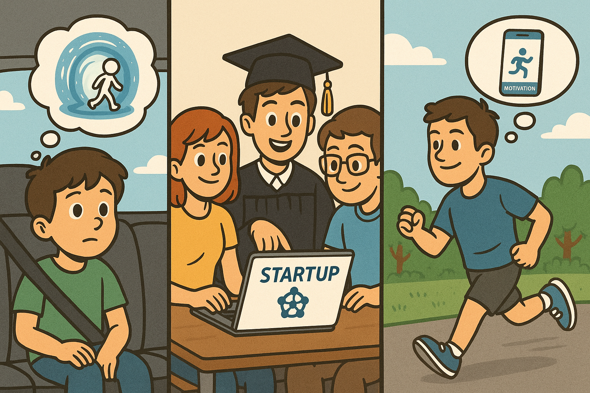

+++
date = '2025-07-31'
draft = false
title = 'Starting a Side Project with AI: From Childhood Dreams to Modern Experiments'
description = "From childhood dreams of inventing a teleportation device to building a side hustle with AI, here’s how I used ChatGPT to brainstorm and refine a new business idea."
keywords = ["AI side hustle", "business ideas with AI", "ChatGPT brainstorming", "habit building app", "start a business with AI", "side hustle ideas", "entrepreneurship", "learning through AI", "AI for entrepreneurs", "personal growth"]
tags = ["AI", "entrepreneurship", "side hustle", "learning"]
categories = ["Entrepreneurship", "AI", "Experiments"]
slug = 'side-project-with-AI'
+++

I’ve always been fascinated by the idea of creating my own business. As a child, my dream wasn’t to start a startup or join a big company: it was to invent a teleportation device. I suffered from motion sickness and imagined how wonderful it would be to zap from one place to another without the long, uncomfortable hours in between.

Years later, while studying in Chicago, three friends and I took our first real shot at entrepreneurship. What started as a class assignment grew into something bigger: a startup idea we called HubRoad. The concept was simple but powerful: help students track their job applications in one place, while also providing key resources like interview prep tips and company insights.

We learned so much in the process: built a business strategy, created a pitch deck, developed a Minimum Viable Product, and coded both the front and back ends ourselves. We even won a prize in our school’s startup competition. At the time, we dreamed big! We wanted to become the next Elon Musk and be rich and famous.

But reality soon caught up with us. We graduated, started our careers, and struggled to keep the project alive while working full-time and living in different cities. Eventually, HubRoad faded away.

## A Shift in Motivation

Now, several years later, I find myself drawn again to the idea of starting a side project. But this time, my motivation is different. I’m not chasing fame or fortune, I want to keep learning. Technology and business strategies evolved so quickly that the best way to stay curious is to experiment firsthand.

The biggest difference compared to ten years ago? We now have AI as a creative partner. Instead of staring at a blank page or waiting for inspiration, I can brainstorm with ChatGPT and generate ideas step by step.

Recently, inspired by Anne-Laure Le Cunff’s book Tiny Experiments, I decided to run one myself. I opened ChatGPT and typed:

“Can you ask me a set of questions, one after the other, to help me figure out the best side hustle opportunity based on my skills?”

## The Power of AI Brainstorming

The experience surprised me. Instead of spitting out random suggestions, ChatGPT guided me through a reflection process:
- What skills do I enjoy using?
- What motivates me?
- What problems do I care about solving?

Step by step, the questions helped me connect dots and learn about my motivations. By the end, I had landed on an idea that felt like me: **a habit-building app for aspiring runners and cyclists that rewards consistency and small wins**.

## What’s Next

I don’t know yet where this experiment will lead, but that’s exactly the point. This time, the journey matters more than the outcome. Building a side project with AI isn’t about chasing the next big thing; it’s about using powerful new tools to learn, create, and grow along the way.