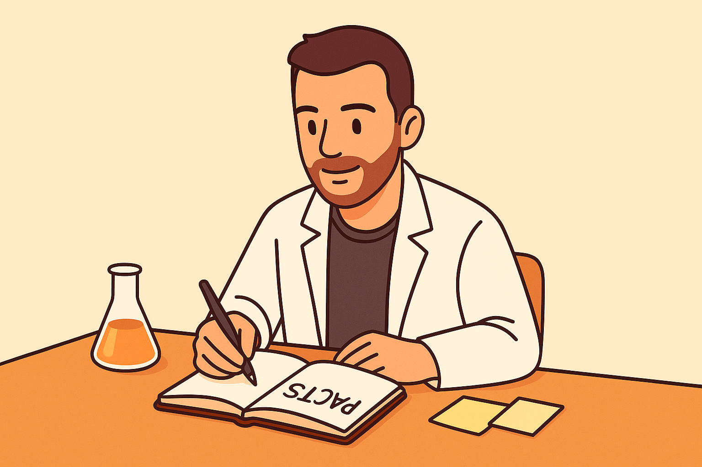

+++
title = "What I Learned from Tiny Experiments"
date = 2025-08-12
description = "My takeaways from Anne-Laure Le Cunff’s Tiny Experiments: swapping rigid goals for PACTs, working in Kairos time, learning in public, and building growth loops."
tags = ["book notes", "Anne-Laure Le Cunff", "Tiny Experiments", "experiments", "PACT", "time management", "procrastination", "perfectionism", "metacognition", "community", "learning in public", "Kinethos"]
categories = ["Book Notes", "Self-Improvement"]
draft = false
slug = "tiny-experiments-learnings"
+++

I recently finished Anne-Laure Le Cunff’s *Tiny Experiments*, an amzing book showing how to live your life as a series of small experiments designed to learn and follow your curiosity instead of focusing on broken concepts like Goals and linear thinking! Below are the ideas that stuck with me and how I’m trying to apply them to my life.

## Goals are overrated; curiosity scales better

Early in the book, Anne-Laure makes a case that traditional goals often carry someone else’s definition of success: a view of how you should live your life and the idea that any deviation from them equate to failure. They’re not flexible and hard to measure. Goals are often linked to **Cognitive Scripts** we impose on ourselves:
- The **sequel script** (continuation bias): keep acting like past-you because change feels risky.
- The **crowd-pleaser script**: behave as people around you expect (parents, partners, colleagues).
- The **epic script**: chase a single, all-consuming passion in some grand, cinematic way.

Her alternative: follow your curiosity and run tiny experiments. Instead of trying to predict the path, pay attention to what gives you energy and iterate from there. The book suggests using **field notes**: capture moments of interest, energy, or friction as they happen; write down questions; turn them into experiments.

## PACTs: curiosity driven experiment for daily life

Anne-Laure defines her experiments as **PACTs**:

> "I will do X for Y repetitions (or until Z)."

The focus is on **lead metrics**, inputs we can control, rather than outcomes. Her advice is to start small (ten days for example), reflect, and iterate. The compounding comes from second-order effects: small tweaks that accumulate.

What a PACT isn't:
- **A habit:** It’s time-bound and explicitly experimental.
- **A New Year’s resolution:** It’s small by design, and “failure” is new data and thus should be seen as progress.

### My current PACTs

- I will publish at least two posts per month on my site for the next six months.
- I will work two hours per week on **Kinethos**, my side project to build an AI coach for amateur athletes, for the next 2 months.

### Growth loops to learn from your PACTs

We should reserve time for Metacognition, thinking about thinking. This is especially hard nowadays when everything fights for our attention: social media, TV, ... The book argues for deliberate input-free time and scheduling weekly reflection session based on **Plus, Minus, Next** review:

| Plus "+"       | Minus "-"   | Next "→"                                           |
| -------------- | ----------- | -------------------------------------------------- |
| What went well | What didn’t | What I’ll adjust this week based on what I learned |

### Learn in public

Publishing PACTs and sharing learnings accelerates the loop. It attracts peers, surfaces better ideas, and builds accountability. Don't be afraid to show the raw stuff: failures as well as successes! People are more likely to connect with you if it feels real, because they will have experienced the same things.

This is why my first PACT is to publish two articles per month to leave a public trail of learning.

### What's next at the end of a PACT?

When a PACT ends, Anne-Laure proposes three options:
- **Persist**: If it works, keep the PACT as it is. Not everything needs to grow, escalate.
- **Pause**: If it doesn’t fit, stop. don't fall into sunk-cost fallacy.
- **Pivot**: Use what you learned from the experiment to change it to better suit you.

## Other useful concepts presented in the book
### Live in Kairos time

We live in a culture that glorifies output and pushes us to always do more, faster. Our live is controlled by the clock: wake up at 6AM with an alarm, 30 minutes meetings, ...

Greeks had 2 words for time:
- **Chronos** is clock time, quantity of time. The only one we consider nowadays.
- **Kairos** is the felt rightness of a moment, quality of time.

Anne-Laure suggests improving the way we manage our time, to live in Kairos time: 
- **Energy**. Work in your “magic window” and prioritize true rest.
- **Executive function**. Match the task to the moment; no multitasking.
- **Kairos rituals**. Small cues that ease you into deep work.

I will try to implement this by creating the perfect Kairos morning routine for me: Wake without alarm, meditate for 10 minutes, go for my morning run/strength training, then spend the first two hours on deep / focused work with nice cup of coffee, and **no email** to start the day.

### Procrastination is a signal, not a sin

Another idea I liked: Procrastination is not laziness or failure, but the sign of a psychological block, use procrastination to understand what is blocking you. The book invites a quick diagnostic:
- **Head**: Is this the right task (or priority) now?
- **Heart**: Am I motivated by the task? Is it aligned with my interests?
- **Hand**: Do I feel that I have the skills required to handle the task?

### Community as a force multiplier

We think better together, especially when we specialize. The book’s framing clicked with my world of sport: athletes perform because a coach plans training, a nutritionist guides fueling, and a physio optimizes recovery. If you had to think through all of that alone, you’d burn out before lacing up. That’s how I picture **Kinethos**: provide pro level support to amateur athletes so they can perform at their best without carrying the mental load! 

More broadly, Anne-Laure describes how we should all find and join communities that ressemble us and go through 3 stages:
- **Apprentices**: learn from the community and its members
- **Artisan**: bring value to the community thanks to your unique skills
- **Architect**: improve your communities / design new ones

### Rethinking legacy: be generative

Chasing linear success, title, money, fame, rarely satisfies. The hedonic treadmill keeps moving. The book nudges us toward being **generative**: use your skills to create value for others, grow lateral roots beyond your obvious path, and share your lessons, even when experiments fail. Anne-Laure relates this to the idea from Sam Altman that that how lucky you are can be improved by increasing your "surface area"

> “Luck isn’t an independent variable but increases super-linearly with more surface area, you meet more people, make more connections between new ideas, learn patterns.”
> - Sam Altman